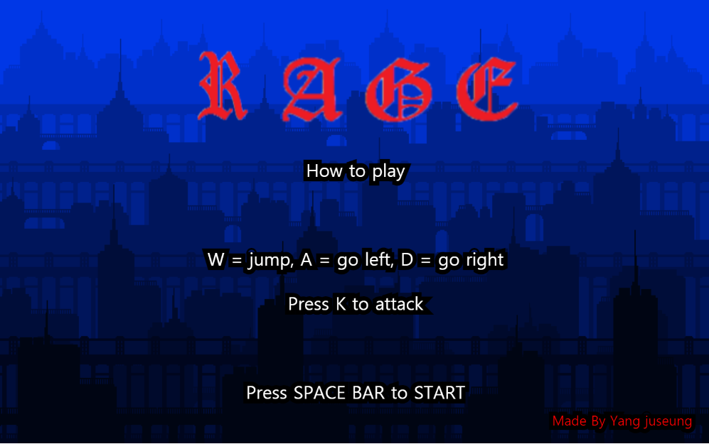
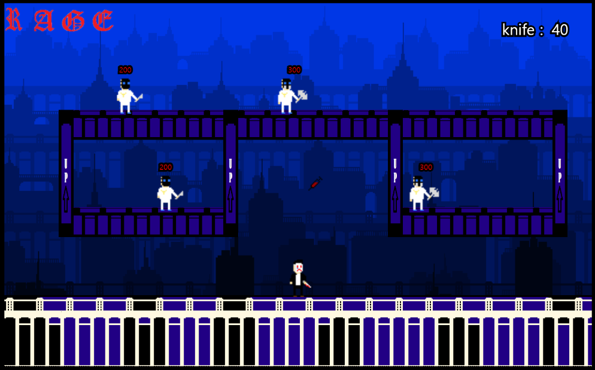
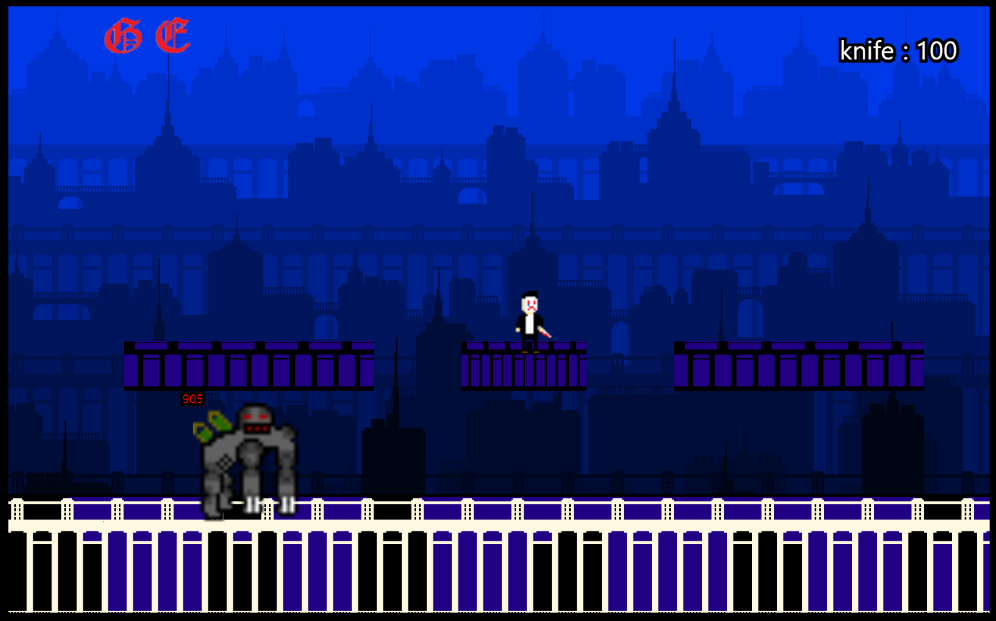

-theme

- Escape the unknown lab and revenge to the scientists who did a medical experiment to main character
- 2D action platform game

-setting
sett show the image and play back ground sound. Also I made function call Mobs and drug, life, etc.

- main scene

it described how to move and how to fight
- cut scene1

- cut scene2

- cut scene3

-level1 

-level2

- cut scene4

-scenario
The man who walk on the street met the monster at the alley. The monster attacked the man and he passed out. And then one strange scientists came toward the man and take him to the unknown lab. The man got the medical experiment. When he woke up at the tube filled with strange liquid he felt pain and strong strength because of medical experiment. He put the mask on which is on the desk and picked up the knifes and killed all the scientists. When he finally killed the monster he felt a bit released. But the man didn't know some one was watching him.

-mechanic

-I made a gravity and collisions to make a platform and hit box between user and Mobs